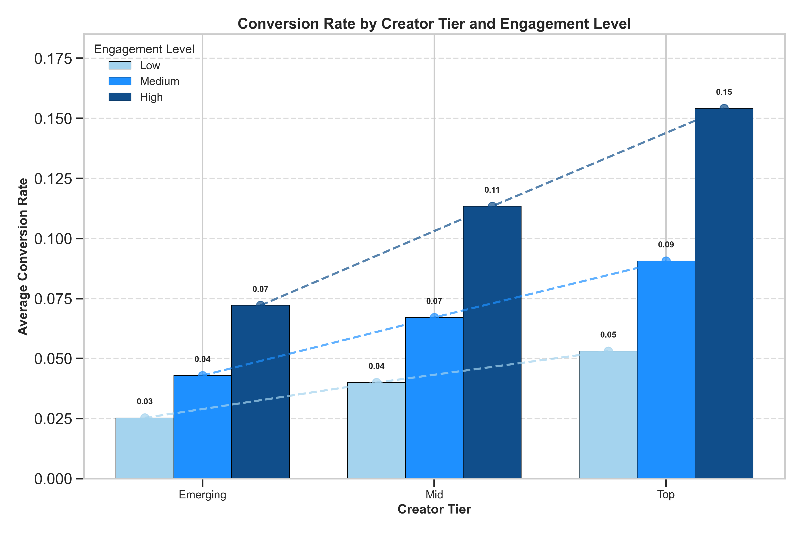

# Amazon Live Programming Strategy Analysis

A data-driven approach to optimizing creator performance, category programming, and audience engagement for Amazon Live streaming.

## Project Overview

This project demonstrates a data-driven methodology for developing effective programming strategies for Amazon Live. Currently, the main branch uses synthetic data to showcase the analytical approach and strategy generation process.

### 🌿 Real-World Data Integration (Feature Branch)

**Interested in Real-World Data?**
- Check out the `feature/use-real-datasets` branch
- Experimental integration of:
  - Brazilian E-Commerce Dataset (Olist)
  - Summer Products Dataset
  - YouTube Engagement Data
- *Status*: Ongoing research and data transformation

> **Note**: The `feature/use-real-datasets` branch is an active exploration of how real-world datasets could be leveraged for more precise insights. Expect ongoing development and potential methodology adjustments.

## Sample Visualizations

Our synthetic data generation creates insightful visualizations that demonstrate the potential of data-driven strategy development:

### Category Revenue Trends

Tracks monthly revenue performance across top product categories, highlighting:
- Seasonal variations
- Category growth patterns
- Potential programming opportunities

### Creator Performance Analysis

Breaks down creator performance by:
- Revenue per minute
- Creator tier
- Individual creator effectiveness

### Conversion Rate Insights

Explores the relationship between:
- Creator tiers
- Engagement levels
- Conversion rates

## Current Implementation: Synthetic Data Approach

The main branch provides a fully functional demonstration using:
- Programmatically generated data
- Simulated performance metrics
- Algorithmic strategy generation

## Analysis Components

### 1. Creator Performance Analysis
- **Methodology**: Identifies top-performing creators 
- **Key Metrics**: 
  - Revenue per minute
  - Viewer retention
  - Category specialization
- **Implementation**: `sql_queries/02_creator_performance_analysis.sql`
- **Business Application**: Optimizing creator scheduling and category assignments

### 2. Time Slot Optimization
- **Methodology**: Analyzes simulated viewer behavior patterns
- **Key Metrics**:
  - Conversion by time of day
  - Day of week performance
  - Hourly trends
- **Implementation**: `sql_queries/03_time_slot_optimization.sql`
- **Business Application**: Creating an optimized weekly programming calendar

### 3. Category Performance Analysis
- **Methodology**: Evaluates product category effectiveness
- **Key Metrics**:
  - Category RPM
  - Seasonal trends
  - Cross-promotion opportunities
- **Implementation**: `sql_queries/04_category_performance_analysis.sql`
- **Business Application**: Prioritizing high-converting categories in prime time slots

### 4. Audience Engagement Patterns
- **Methodology**: Correlates engagement metrics with conversion outcomes
- **Key Metrics**:
  - Engagement-to-conversion correlation
  - Creator tier engagement strategies
- **Implementation**: `sql_queries/05_viewer_engagement_analysis.sql`
- **Business Application**: Developing content strategies to maximize viewer conversion

## Strategy Generation Process

The programming strategy document is automatically generated through:
1. Data Processing: Generating structured insights
2. Pivot Table Generation: Transforming data into multi-dimensional analyses
3. Recommendation Extraction: Identifying key patterns algorithmically
4. Strategy Document Creation: Compiling comprehensive programming recommendations

## Project Structure
- `sql_queries/`: SQL scripts for data transformation and analysis
- `src/`: Python scripts for data processing and strategy generation
- `analysis/`: Output files including pivot tables and strategy documents
- `visualizations/`: Generated charts and graphs

## Key Features
- Data-Driven Decision Making
- Cross-Category Optimization
- Creator Tier Strategies
- Time Slot Optimization
- Engagement-Conversion Correlation

## Visualization Methodology

These visualizations are generated programmatically to:
- Simulate real-world content performance
- Demonstrate data analysis techniques
- Provide actionable insights
- Showcase potential programming strategies

**Note**: All visualizations are based on synthetically generated data and are for demonstration purposes.

## Required Dependencies
- pandas
- numpy
- matplotlib
- seaborn
- mdpdf
- openpyxl

## Usage
1. Install dependencies: `pip install -r requirements.txt`
2. Generate pivot tables: `python src/generate_pivot_tables.py`
3. Create strategy document: `python src/generate_programming_strategy.py`

## Contributions and Feedback

### Data Integration Exploration
- Interested in helping integrate real-world datasets?
- Have insights on transforming external data sources?
- Open to collaborating on the `feature/use-real-datasets` branch!

Please open an issue or submit a pull request with your ideas and contributions.

## Disclaimer
This project uses synthetic data in the main branch. The `feature/use-real-datasets` branch is an experimental approach to incorporating real-world datasets.

## Author
Matt O'Brien

## About
A data-driven toolkit for simulating streaming content strategy optimization. Generates actionable recommendations with visualizations including time slot heatmaps, cross-promotion networks, and strategic planning documents.
